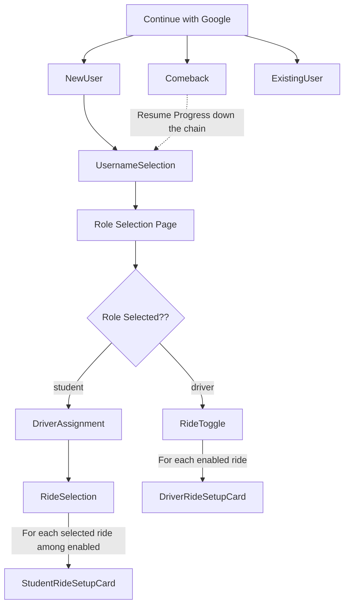
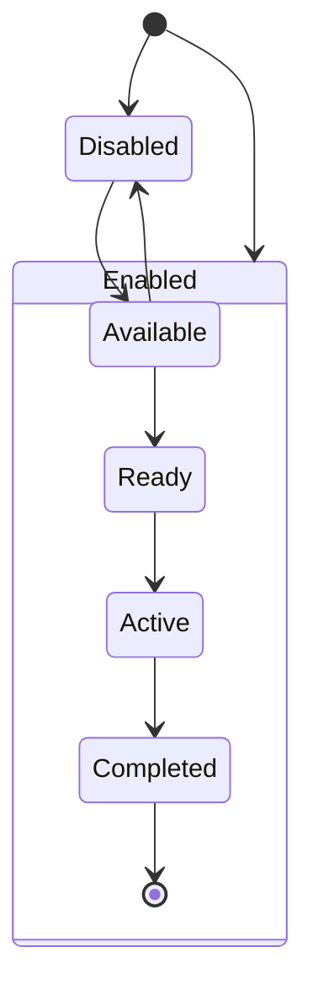
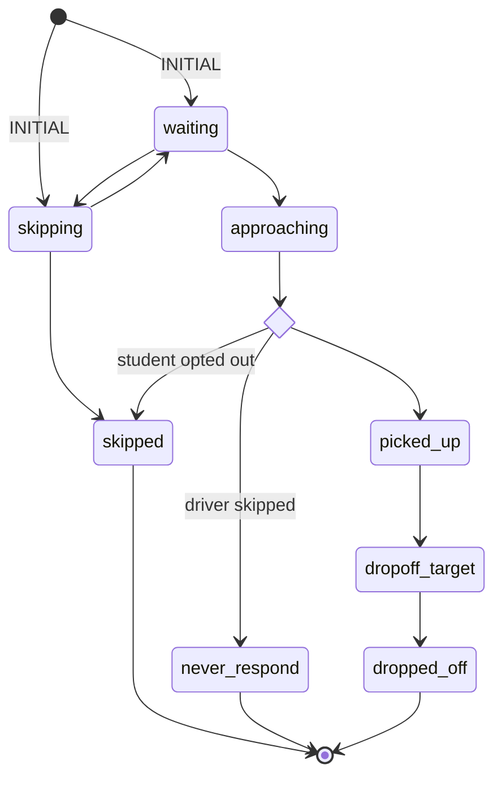

# Onboarding

### Flow Diagram

# Live Trip Screen

### Trip State

#### Disabled State
The above diagram applies to both students/drivers.
- Driver -> Unable to disable a trip if already `Active`.
- Student -> If a student disables a trip, they don't recieve further
notifications for

### Participant State

### View eligibility — StudentTripStatus

| State          | Pickup view shows as  | Dropoff view shows as      |
|----------------|-----------------------|----------------------------|
| waiting        | Waiting               | Preview (renders pickup)   |
| skipping       | Skipping              | Preview (renders pickup)   |
| approaching    | Approaching           | Preview (renders pickup)   |
| picked_up      | Done (terminal)       | Active — picked_up         |
| dropoff_target | Done (terminal)       | Active — dropoff_target    |
| dropped_off    | Done (terminal)       | Active — dropoff_target    |
| skipped        | Skipped (terminal)    | Skipped (terminal)         |
| never_respond  | No response (terminal)| No response (terminal)     |

